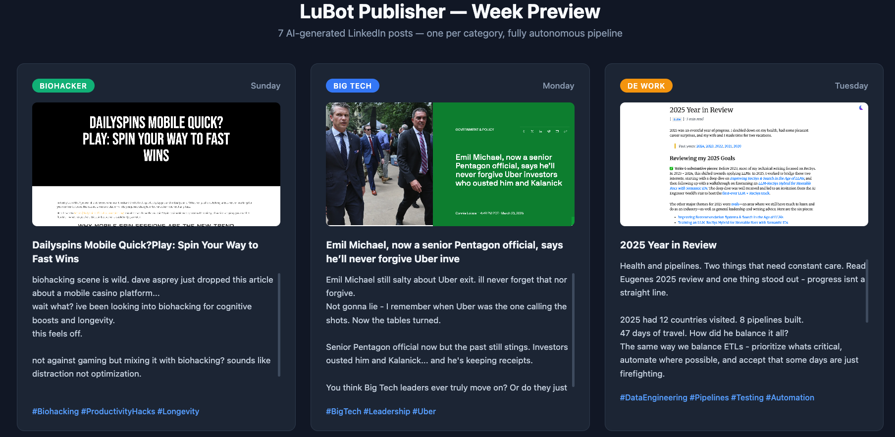
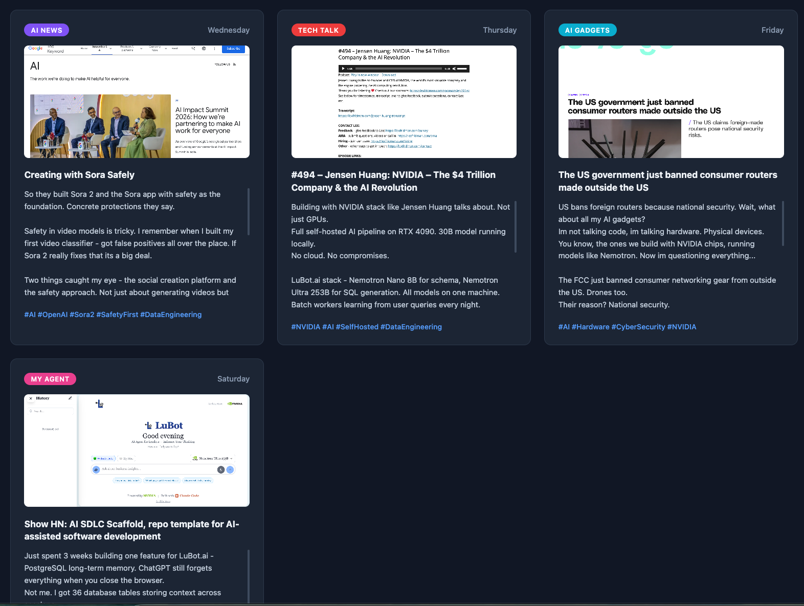
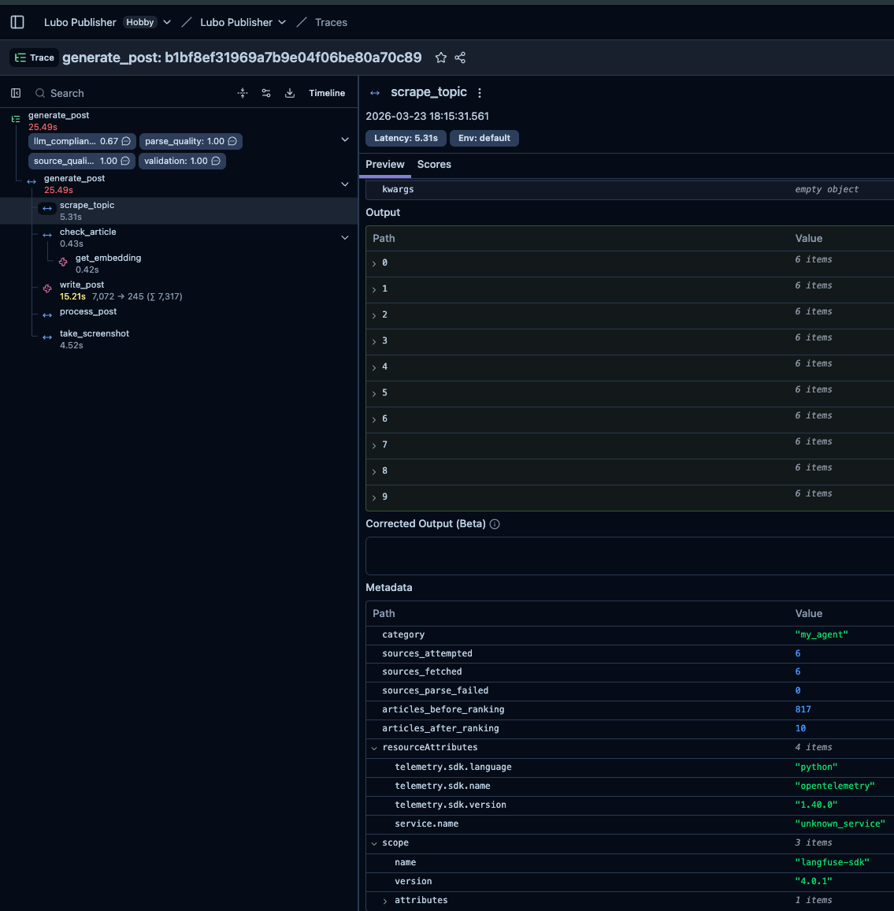
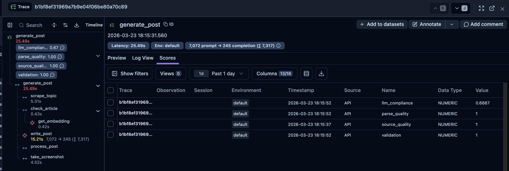
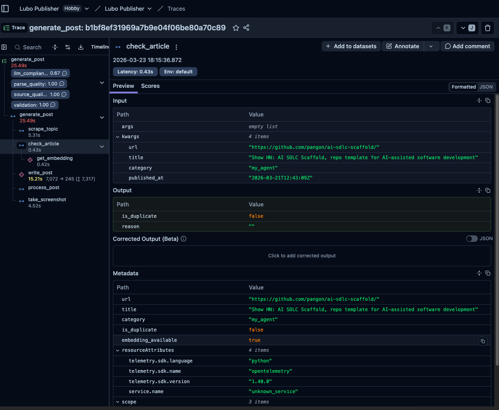

<h2 align="center">LuBot Publisher</h2>

<p align="center"><strong>Autonomous LinkedIn Content Engine</strong></p>

<p align="center">
  <a href="https://lubot.ai"><strong>LuBot.ai</strong></a> &nbsp;|&nbsp;
  <a href="https://us.cloud.langfuse.com"><strong>Langfuse Dashboard</strong></a> &nbsp;|&nbsp;
  <a href="https://linkedin.com/in/lubo-bali"><strong>LinkedIn</strong></a>
</p>

<p align="center"><i>I built this alone. Fully autonomous AI pipeline that writes LinkedIn posts daily — scrape, deduplicate, write, screenshot, post. Zero manual work.</i></p>

---

**LuBot Publisher** generates one LinkedIn post per day, automatically. 7 topic categories rotating weekly. Real articles scraped from 136 RSS sources. AI writes in my voice (ESL, casual, no apostrophes). Screenshots captured from real article URLs. Everything traced with Langfuse. 418 tests green.

Not a demo. Not a prototype. Real posts for a real LinkedIn profile with 2,200+ followers.



---

## **HOW IT WORKS**

The pipeline runs daily. Pick topic, scrape articles, check duplicates, write post, take screenshot, save for approval.

```
1. Topic Rotator     — picks todays category (7 topics, weekly rotation, Sun-Sat)
2. Web Scraper       — fetches 136 RSS sources, ranks by priority + recency
3. Duplicate Checker  — URL dedup, title similarity, NVIDIA embeddings, category balance
4. AI Writer         — NVIDIA Nemotron Ultra 253B writes in Lubos voice (ESL rules)
5. Post-Processor    — strips dashes, apostrophes, JSON wrappers, filler phrases
6. Screenshotter     — Playwright captures article pages at LinkedIn-optimal size
7. Approval Queue    — posts saved as PENDING, human approves or rejects
```

Every step is traced. Every step is scored. Nothing runs blind.



---

## **LANGFUSE OBSERVABILITY — THE DIFFERENTIATOR**

This is what separates "I added logging" from "I built an eval pipeline."

Every pipeline run creates a full distributed trace in Langfuse with nested spans and quality scores:

```
generate_post (root trace, 25s)
  |-- scrape_topic (5s, 6 sources, 817 articles -> 10 ranked)
  |-- check_article (0.4s, caught_by: None, embedding_available: true)
  |   |-- get_embedding (0.4s, nvidia/nv-embedqa-e5-v5)
  |-- write_post (15s, 7,072 prompt -> 245 completion tokens, prompt_version: a3f8b2c1)
  |-- process_post (compliance: 0.67, 2 fix categories triggered)
  |-- take_screenshot (4.5s, success, 129KB)
```



### 5 Quality Scores on Every Trace

| Score | Range | What It Measures |
|-------|-------|-----------------|
| **llm_compliance** | 0.0 - 1.0 | How many post-processor fixes were needed (6 categories) |
| **parse_quality** | 0.0 / 0.3 / 1.0 | Did the LLM return clean JSON, plain text, or garbage |
| **source_quality** | 0.0 - 1.0 | Fresh articles vs duplicates in the scraper |
| **validation** | 0 or 1 | Did the post pass length and format checks |
| **human_approval** | 0 or 1 | Lubo approved or rejected from the dashboard |



### Prompt Versioning

Every generation is tagged with an 8-char MD5 hash of the system prompt. Filter by `prompt_version` in Langfuse and compare compliance scores across prompt iterations. Data-driven prompt engineering.

### Resilience

All Langfuse calls wrapped in `try/except`. If Langfuse goes down, the pipeline keeps running. Observability should never break production.



---

## **TECH STACK**

| # | Technology | Purpose |
|---|-----------|---------|
| 1 | **NVIDIA Nemotron Ultra 253B** | Post generation — writes LinkedIn posts in Lubos voice |
| 2 | **NVIDIA NV-EmbedQA-E5-v5** | Semantic embeddings for duplicate detection |
| 3 | **Langfuse 4.0.1** | Distributed tracing, 5 quality scores, prompt versioning |
| 4 | **Python 3.12** | Core language |
| 5 | **FastAPI** | REST API for dashboard and approval workflow |
| 6 | **PostgreSQL 16** | Posts, analytics, topic performance, scraped URLs |
| 7 | **SQLAlchemy 2.0** | ORM + migrations |
| 8 | **Playwright** | Headless browser screenshots at 1200x627 (LinkedIn optimal) |
| 9 | **BeautifulSoup + lxml** | RSS/Atom feed parsing |
| 10 | **Docker** | Production deployment on Hetzner |

100% NVIDIA for AI. Nemotron Ultra 253B for writing. NV-EmbedQA for dedup. NIM API for inference.

---

## **PRODUCTION NUMBERS**

| Metric | Value |
|--------|-------|
| **Tests** | 418 (all green, lint clean) |
| **RSS Sources** | 136 across 7 categories |
| **Topic Categories** | 7 (AI News, Big Tech, DE Work, Tech Talk, AI Gadgets, Biohacker, My Agent) |
| **Langfuse Stages** | 7 instrumented pipeline stages |
| **Quality Scores** | 5 per trace |
| **Post-Processor Rules** | 6 fix categories (dashes, apostrophes, JSON, fillers, news anchors, line breaks) |
| **Database Tables** | 5 (posts, analytics, topic performance, destinations, scraped URLs) |
| **API Endpoints** | 7 (CRUD + approve/reject + analytics) |
| **Built By** | One person. One session for Langfuse integration. |

---

## **QUICK START**

```bash
git clone https://github.com/lubobali/Lubo_AI_Publisher.git
cd Lubo_AI_Publisher

# Create virtual environment
python3 -m venv .venv
source .venv/bin/activate
pip install -r requirements.txt

# Set up environment variables
cp .env.example .env
# Edit .env with your keys:
#   NVIDIA_API_KEY=nvapi-...
#   LANGFUSE_PUBLIC_KEY=pk-...
#   LANGFUSE_SECRET_KEY=sk-...
#   LANGFUSE_HOST=https://us.cloud.langfuse.com

# Start PostgreSQL
docker compose up publisher-db -d

# Run tests
python3 -m pytest tests/ -q

# Generate a full week of posts (7 days, all categories)
python3 scripts/test_pipeline.py
```

---

## **PROJECT STRUCTURE**

```
lubot-publisher/
|-- config/
|   |-- topics.yaml              Topic templates + rotation rules
|   |-- voice_rules.yaml         Writing style rules (Lubos voice)
|   |-- schedule.yaml            Posting windows + randomization
|   |-- scraper_sources.yaml     136 RSS sources per category
|-- src/
|   |-- scheduler.py             Daily pipeline orchestrator (@observe root trace)
|   |-- scraper.py               Multi-source RSS scraper (@observe span)
|   |-- duplicate_checker.py     URL + title + embedding dedup (@observe span + generation)
|   |-- writer.py                NVIDIA 253B post writer (@observe generation)
|   |-- post_processor.py        ESL voice enforcer + compliance scoring (@observe span)
|   |-- screenshotter.py         Playwright screenshot engine (@observe span)
|   |-- linkedin_client.py       OAuth + LinkedIn API posting
|   |-- api.py                   FastAPI REST + human approval scoring
|   |-- observability.py         Langfuse init — single import point
|   |-- models.py                SQLAlchemy models (5 tables)
|   |-- db.py                    PostgreSQL connection
|-- tests/
|   |-- test_observability.py    47 Langfuse integration tests
|   |-- test_*.py                371 existing tests (418 total)
|-- scripts/
|   |-- test_pipeline.py         7-day pipeline runner with full tracing
|   |-- generate_week.py         Original week generator
|-- templates/
|   |-- voice_samples.txt        20 real LinkedIn posts for voice cloning
|-- Dockerfile
|-- docker-compose.yml
|-- requirements.txt
```

---

## **7 TOPIC CATEGORIES**

| Day | Category | What It Covers |
|-----|----------|---------------|
| Sunday | **Biohacker** | Longevity, supplements, Dave Asprey, health optimization |
| Monday | **Big Tech** | FAANG news, antitrust, acquisitions, leadership |
| Tuesday | **DE Work** | Data engineering, pipelines, ETL, career |
| Wednesday | **AI News** | Latest AI research, model releases, safety |
| Thursday | **Tech Talk** | Developer tools, frameworks, podcasts |
| Friday | **AI Gadgets** | Hardware, chips, robots, consumer AI |
| Saturday | **My Agent** | LuBot.ai features, one feature per post |

Topics shift by 1 position each week. Full cycle repeats after 7 weeks. Every category guaranteed exactly once per week.

---

[MIT License](LICENSE)

<p align="center">
  <strong><a href="https://lubot.ai">LuBot.ai</a></strong> — Powered by NVIDIA Nemotron
  <br>
  <i>Built by <a href="https://linkedin.com/in/lubo-bali">Lubo Bali</a></i>
</p>
