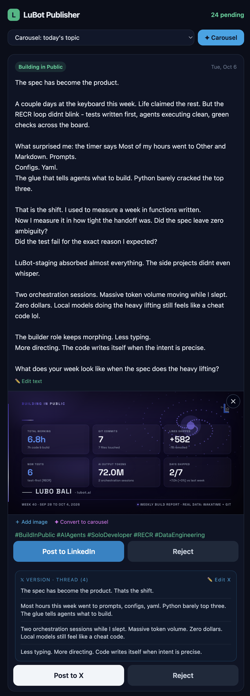
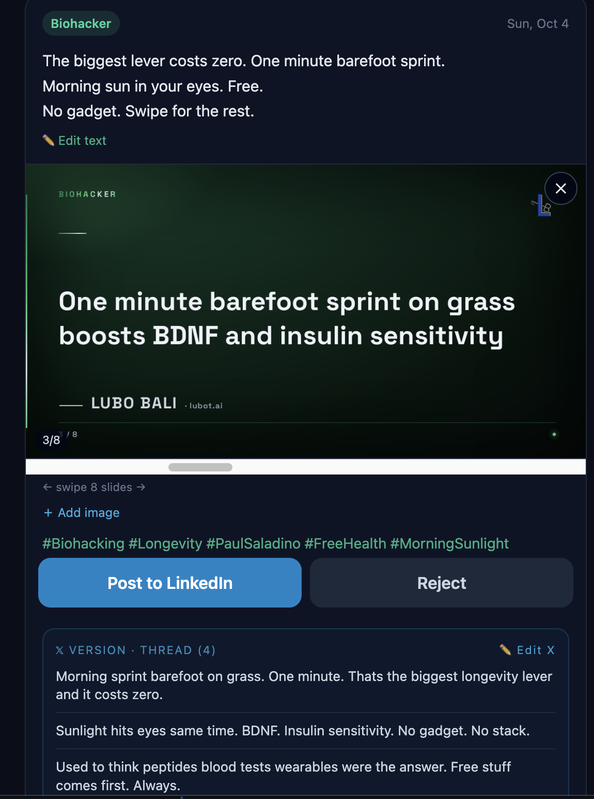
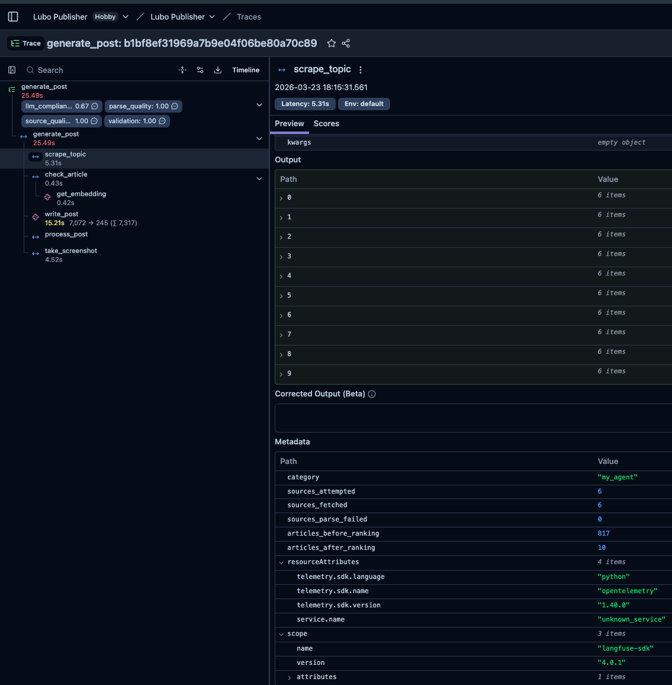

<h2 align="center">LuBot Publisher</h2>

<p align="center"><strong>Autonomous AI content engine for LinkedIn + X</strong></p>

<p align="center">
  <a href="https://lubot.ai"><strong>LuBot.ai</strong></a> &nbsp;|&nbsp;
  <a href="https://www.linkedin.com/in/lubo-bali"><strong>LinkedIn</strong></a> &nbsp;|&nbsp;
  <a href="https://lubobali.com/"><strong>Lubo Bali</strong></a>
</p>

<p align="center"><i>I built this alone. It reads podcasts, blogs, market data, my own git log and my coding stats, writes posts in my voice, designs the image, and waits for one tap on my phone. Then it publishes to LinkedIn and X.</i></p>

---

**LuBot Publisher** writes **9 posts a week across 7 topics**. Every post starts from a real source (a podcast episode, a market chart, a commit, a blog post), is grounded in a private library of 11 technical books, and is written by **NVIDIA Nemotron 3 Ultra 550B** in my voice. Nothing is posted without my approval. Once I tap approve, a background worker publishes it to LinkedIn and as a native thread on X, with a tracked link in the first comment.

Live in production on a Hetzner box since June 2026. 800+ tests, Postgres in CI, lint clean.

<table>
  <tr>
    <td width="50%" valign="top"></td>
    <td width="50%" valign="top"></td>
  </tr>
  <tr>
    <td align="center"><i>Approval dashboard: each draft has its own LinkedIn and X version</i></td>
    <td align="center"><i>A Biohacker carousel draft, 8 slides, with a 4-tweet X thread</i></td>
  </tr>
</table>

---

## How it works

```
                   ┌───────────── daily_planner (00:01 CT) ─────────────┐
                   │  picks today's slot(s) from schedule.yaml and       │
                   │  schedules each at a random minute in its window    │
                   └──────────────────────────┬──────────────────────────┘
                                              ▼
 1. TOPIC      topic_rotator.py      which of the 7 topics owns this slot
 2. SOURCE     one input per topic   podcast / yfinance / git log / DevTrack / RSS
 3. DEDUP      duplicate_checker.py  URL + title + embedding similarity vs past posts
 4. LEARN      self_learner.py       what performed well lately → hints for the writer
 5. RAG        knowledge_base.py     2-3 relevant book concepts (technical topics only)
 6. WRITE      writer.py             Nemotron 550B, voice rules, truth rules, anti-repeat
 7. CLEAN      post_processor.py     strips markdown / rule leaks / reasoning dumps, ESL voice
 8. GUARD      numbers_grounded()    Market Pulse: every number must exist in the real data
 9. IMAGE      cards.py + Playwright branded card per topic (charts, stat cards, headlines)
10. X VERSION  writer.py             separate short X thread, not a copy of the LinkedIn post
11. SAVE       status = PENDING      nothing goes out yet
                                              ▼
              Dashboard (publisher.lubot.ai) — I read it on my phone
              each platform version has its own Post / Reject button
                                              ▼
12. PUBLISH   publish_approved (every 5 min)
              LinkedIn post + first comment with tracked short link
              X thread + self-reply with the link
```

Every stage can be traced in Langfuse (optional, off by default) with quality scores per run.

---

## The 7 topics and where each one gets its material

| Topic | Primary source | Fallback | Image |
|---|---|---|---|
| **Biohacker** (3x/week) | Podcast episodes, transcribed and distilled: *The Human Upgrade* (Dave Asprey), *Paul Saladino MD*, *The Ultimate Human* (Gary Brecka) | 18 RSS feeds (Asprey, Saladino, Brecka, Attia, Nature Medicine…) | Insight card |
| **AI News** | Weekly *Moonshots with Peter Diamandis* episode, read for news | 27 RSS feeds (OpenAI, DeepMind, NVIDIA, Hugging Face, MIT Tech Review…) | Headline card |
| **Tech Talk** | Same Moonshots episode, read for ideas worth a senior opinion | 23 RSS feeds (Pragmatic Engineer, Latent Space, Stratechery, Martin Fowler…) | Insight card |
| **Market Pulse** | Real index data from **yfinance**. The symbols on the chart are picked from the week's market podcasts (*Animal Spirits*, *RiskReversal*, *Money Life*, *Investing Experts*) | — | ECharts market card |
| **Investing Principle** | Evergreen wisdom from finance blogs (JL Collins, A Wealth of Common Sense, Of Dollars and Data, The New Frontier) | CNBC / MarketWatch RSS | Insight card |
| **My Agent Build** | **My real git log** from LuBot staging: commits grouped by feature, noise filtered, real +/- lines | — | Terminal-style git card |
| **Building in Public** | **My real coding week** from DevTrack-AI weekly reports / WakaTime archives: hours, languages, AI usage, week-over-week momentum | Raw WakaTime | Stat card |

All feeds live in [`config/scraper_sources.yaml`](config/scraper_sources.yaml), topics in [`config/topics.yaml`](config/topics.yaml).

### Weekly schedule (America/Chicago)

| Day | Post 1 | Post 2 |
|---|---|---|
| Sun | Biohacker (10am–12pm) | rotating topic (7–9pm) |
| Mon | rotating topic (3–5pm) | |
| Tue | rotating topic (3–5pm) | |
| Wed | Biohacker (6–8am) | rotating topic (3–5pm) |
| Thu | rotating topic (3–5pm) | |
| Fri | Biohacker (3–5pm) | |
| Sat | rotating topic (11am–1pm) | |

The 6 other topics fill the "rotating" slots once each and shift by one slot every week, so the same topic is not always on the same day. The exact minute is random. These are *draft* times. The post goes live when I approve it. Config: [`config/schedule.yaml`](config/schedule.yaml).

---

## Knowledge base (RAG)

Technical posts (AI News, Tech Talk, My Agent Build, Market Pulse, Investing Principle) get 2–3 concepts from a private library as background. The writer may use the idea but **never names the book** and never claims it did something it did not.

**Library (about 4,600 chunks):**
- *Designing Data-Intensive Applications*: Kleppmann
- *Fundamentals of Data Engineering*: Reis & Housley
- *Data Engineering Cookbook*: Andreas Kretz
- *Fundamentals of Metadata Management*
- *The Architecture of Open Source Applications*, Vol 1 + 2
- *Dive into Deep Learning*: d2l.ai
- *Foundations of Large Language Models*
- *Speech and Language Processing* (3e): Jurafsky & Martin
- *Machine Learning Yearning*: Andrew Ng
- *Illustrated Guide to Python 3*: Matt Harrison
- Finance blogs (refreshed by `scripts/ingest_stock_feeds.py`): JL Collins, A Wealth of Common Sense, Of Dollars and Data, The New Frontier

**How it is built:**
1. `pypdf` extracts the text. Page numbers and running headers/footers are removed, and so are NUL/control characters.
2. The text is split into ~400-word chunks with 50 words of overlap, cut at sentence boundaries.
3. Each chunk is embedded with **`nvidia/llama-nemotron-embed-vl-1b-v2`** (2048-dim) via NVIDIA NIM.
4. The chunks are stored in Postgres (`publisher_knowledge_base`, with embeddings as JSON).
5. Search uses cosine similarity in numpy with a minimum score of 0.35. If nothing is close enough, the writer gets nothing. *Better nothing than forced.*

No pgvector, no FAISS. At this size, numpy is faster to build and easier to reason about.

The PDFs are **not in this repo** (copyright and size). To build your own, drop PDFs in `books/` and run `python3 scripts/ingest_books.py`.

---

## Truth rules (the part that matters most)

The goal is posts a senior engineer would actually sign. The writer prompt and post-processor enforce:

- **No invented numbers, tools, companies, setups, or personal stories.** If an exact number is not in the source material, it is said in words or not at all.
- **Opinion vs experience.** Tech Talk is framed as an opinion. Only My Agent Build and Building in Public talk about what I did, because those come from my real git log and coding stats.
- **Market numbers are checked**: `numbers_grounded()` compares every figure in a Market Pulse post with the yfinance data and records a `data_fidelity` score.
- **Reasoning-dump guard.** If the model returns its chain-of-thought instead of a post, the result is rejected (it fails closed).
- **Anti-repeat memory.** The last posts in each topic are passed to the writer, and finished posts are embedded so the same idea is not posted twice.
- **Voice.** ESL rules come from 20 of my real posts (`templates/voice_samples.txt`, `config/voice_rules.yaml`): casual, no apostrophes, no dashes, no news-anchor openings.

---

## Tech stack

| Layer | Tech |
|---|---|
| Writer LLM | **NVIDIA Nemotron 3 Ultra 550B** (NIM). OpenRouter is the fallback if NIM fails. Swappable via env |
| Embeddings | `llama-nemotron-embed-vl-1b-v2` (RAG), `nv-embedqa-e5-v5` (dedup) |
| Podcast transcription | Deepgram nova-3, transcripts cached in Postgres |
| Market data | yfinance |
| Images | Playwright renders HTML/CSS cards (ECharts for charts, custom fonts). NVIDIA image gen is the fallback |
| API + dashboard | FastAPI + one static `dashboard.html` (mobile-first) |
| Worker | APScheduler (`src/cron.py`) |
| Database | PostgreSQL 16 + SQLAlchemy 2.0 (8 tables) |
| Publishing | LinkedIn REST API (posts, images, comments), X API via tweepy (threads, media, replies) |
| Attribution | Built-in short links `/go/{code}` → UTM-tagged lubot.ai URL per platform |
| Observability | Langfuse: traces, quality scores, prompt version hashes (optional) |
| Backups | Nightly Postgres dump to Backblaze B2 (04:00) |
| Infra | Docker Compose on Hetzner, nginx + Let's Encrypt, Forgejo CI + GitHub mirror |

### Production layout

```
publisher-web     uvicorn: dashboard + REST API (127.0.0.1:8100, behind nginx)
publisher-worker  APScheduler: daily_planner · publish_approved (5 min) · nightly_backup
publisher-db      PostgreSQL 16: posts, knowledge base, transcripts, short links
```

The worker mounts the LuBot staging repo **read-only**, so My Agent Build and Building in Public read the real git log and DevTrack/WakaTime reports locally. On a dev machine they fall back to SSH.

### Database tables

`publisher_posts`, `publisher_analytics`, `publisher_topic_performance`, `publisher_destinations`, `publisher_scraped_urls`, `publisher_knowledge_base`, `publisher_podcast_transcripts`, `publisher_short_links`

---

## Observability (Langfuse)

When `LANGFUSE_ENABLED=true`, every run is one trace with nested spans (scrape → dedup → embed → write → process → image) and these scores:

| Score | Meaning |
|---|---|
| `llm_compliance` | how many post-processor fixes the output needed |
| `parse_quality` | clean JSON vs plain-text fallback vs garbage |
| `source_quality` | fresh vs duplicate articles |
| `validation` | passed length/format checks |
| `data_fidelity` | Market Pulse: all numbers trace back to real data |
| `human_approval` | I approved or rejected it on the dashboard |

Each generation is tagged with a hash of the system prompt, so prompt changes can be compared on real scores.



---

## Project structure

```
config/
  topics.yaml              7 topics + weekly rotation
  schedule.yaml            9-post weekly plan + posting windows
  scraper_sources.yaml     RSS feeds + podcast feeds per topic
  voice_rules.yaml         my writing style rules
src/
  cron.py                  worker: planner, publisher loop, backups
  scheduler.py             the pipeline (generate_post) + publish logic
  topic_rotator.py         weekly rotation
  scraper.py               RSS/Atom scraper, priority + recency ranking
  podcast_insights.py      podcast feeds → episodes → distilled bullets
  transcription.py         Deepgram client
  stock_insights.py        yfinance weekly pulse + chart symbol selection
  git_insights.py          real git log → feature-grouped build log
  devtrack_insights.py     DevTrack-AI weekly report parser
  wakatime_insights.py     WakaTime archives → weekly stats + momentum
  duplicate_checker.py     URL / title / embedding dedup
  knowledge_base.py        PDF extract → chunk → embed → store → search
  self_learner.py          performance report fed back to the writer
  writer.py                prompts, Nemotron call, OpenRouter fallback, X thread
  post_processor.py        cleanup, voice enforcement, validation, number check
  cards.py                 branded card + chart layouts (HTML)
  screenshotter.py         Playwright render of cards / pages
  image_generator.py       AI image fallback
  publisher.py             multi-platform publisher interface
  linkedin_client.py       LinkedIn OAuth, posts, images, comments
  x_client.py              X posts, media, threads, replies
  shortlinks.py            short codes → UTM redirect
  analytics_worker.py      engagement metrics
  api.py                   FastAPI routes + dashboard
  backup.py                Backblaze B2 backups
  models.py / db.py        SQLAlchemy models + connection
scripts/
  ingest_books.py          build the knowledge base from books/*.pdf
  ingest_stock_feeds.py    pull finance blogs into the knowledge base
  test_pipeline.py         generate a full week end-to-end (dry run)
  make_carousel.py         build a swipeable carousel post
  linkedin_auth.py         LinkedIn OAuth helper
static/                    dashboard.html, fonts, vendored ECharts, logo
templates/voice_samples.txt  my real posts used for voice
tests/                     pytest suite (real Postgres, external APIs mocked)
```

---

## Run it yourself

```bash
git clone https://github.com/lubobali/Lubo_AI_Publisher.git
cd Lubo_AI_Publisher
python3 -m venv .venv && source .venv/bin/activate
pip install -r requirements.txt
playwright install chromium

cp .env.example .env          # add your keys (see below)
docker compose up publisher-db -d

python3 -m pytest tests/ -q              # tests use a separate publisher_test DB
python3 scripts/ingest_books.py          # optional: your own PDFs in books/
python3 scripts/test_pipeline.py         # generate a week of drafts
```

**Keys:** `NVIDIA_API_KEY` is required. The rest are optional, depending on what you turn on: `DEEPGRAM_API_KEY` (podcasts), `OPENROUTER_API_KEY` (fallback LLM), `LINKEDIN_*` and `X_*` (publishing), `LANGFUSE_*` (tracing), `B2_*` (backups).

**Testing approach:** external APIs (LinkedIn, X, NVIDIA, Deepgram, RSS) are mocked; internal logic (rotation, dedup, DB, scoring) runs for real against Postgres. Tests check the pipeline structure, not what the LLM says.

---

[MIT License](LICENSE)

<p align="center">
  <strong><a href="https://lubot.ai">LuBot.ai</a></strong> · Powered by NVIDIA Nemotron
  <br>
  <i>Built by <a href="https://linkedin.com/in/lubo-bali">Lubo Bali</a></i>
</p>
